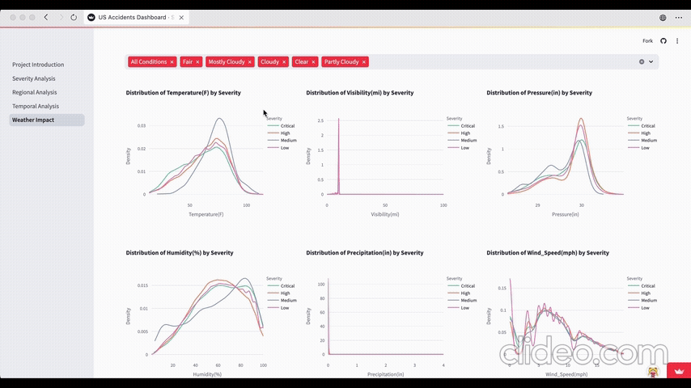

# US Traffic Accidents Analysis Dashboard

## Project Overview
An interactive dashboard analyzing 3.5 million traffic accidents across the United States (2016-2023). This project provides comprehensive insights into accident patterns, severity distributions, and contributing factors through dynamic visualizations.

## 🚀 Features
- **Regional Analysis**: Interactive maps and charts showing accident distributions across states and cities
- **Temporal Analysis**: Time-based trends analysis (yearly, monthly, daily, hourly)
- **Weather Impact**: Analysis of weather conditions' influence on accident frequency and severity
- **Road Condition Impact**: Visualization of how road features affect accident occurrence
- **Severity Analysis**: Deep dive into accident severity patterns and contributing factors


## 🎥 Demo


### Key Features Demo
<details>
<summary>Click to expand demos</summary>

#### Regional Analysis


#### Temporal Patterns


#### Weather Impact


#### Severity Analysis


</details>


## 📊 Key Visualizations
- Choropleth maps showing state-wise accident distributions
- Interactive heatmaps for city-level accident hotspots
- Time series analysis with dynamic filtering
- Weather correlation plots
- Road condition impact analysis
- Severity distribution charts

## 🛠 Technology Stack
- **Frontend**: Streamlit
- **Data Processing**: Pandas, NumPy
- **Visualization**: Plotly, Folium
- **Data Analysis**: SciPy, Scikit-learn
- **Version Control**: Git/GitHub

## 📦 Installation & Setup
1. Clone the repository:
```bash
git clone https://github.com/yourusername/us-accidents-dashboard.git
cd us-accidents-dashboard
```

2. Install requirements:
```bash
pip install -r requirements.txt
```

3. Run the application:
```bash
streamlit run streamlit_app/Project_Introduction.py
```

## 📂 Project Structure
```
us-accidents-dashboard/
├── streamlit_app/
│   ├── Project_Introduction.py
│   ├── constants.py
│   ├── data_processing.py
│   └── pages/
│       ├── 1_Temporal_Analysis.py
│       ├── 2_Regional_Analysis.py
│       ├── 3_Weather_Impact.py
│       ├── 4_Road_Condition_Impact.py
│       └── 5_Severity_Analysis.py
├── data/
│   └── county_fips.csv
├── requirements.txt
└── README.md
```

## 📊 Data Source
The dataset used in this project is sourced from Kaggle's US Accidents dataset, containing approximately 3.5 million records of accidents from February 2016 to March 2023.

## 🔍 Key Findings
1. California has the highest number of accidents, accounting for ~30% of total records
2. Weather conditions significantly impact accident severity
3. Most accidents occur during rush hours (7-9 AM and 4-6 PM)
4. Junction areas show higher accident frequencies
5. Visibility has a strong correlation with accident severity

## 🤝 Contributing
Contributions are welcome! Please feel free to submit a Pull Request.

## 📫 Contact
- Author: [Xiwen Jiang]
- Email: [datasciencejiang@gmail.com]

## 📄 License
This project is licensed under the MIT License - see the LICENSE file for details.

## 🙏 Acknowledgments
- Data source: [Kaggle US Accidents Dataset](https://www.kaggle.com/sobhanmoosavi/us-accidents)
- Streamlit community for excellent documentation and examples
- Contributors and maintainers of the libraries used in this project
